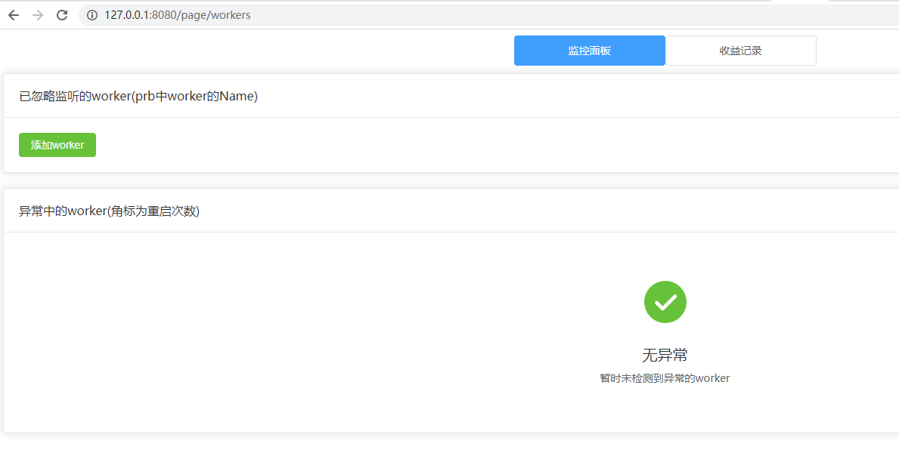

## 部署说明

1. 创建目录

```shell
mkdir /opt/phala-monitor
```

2. 拷贝项目根目录下的`docker-compose.yaml`文件到`/opt/phala-monitor`目录下
3. 配置prb接口信息和邮件信息（请一定要耐心配完配置，详情看下面[参数说明](#参数说明)）
4. 运行服务

```shell
docker-compose up -d
```

5. 查看日志

```shell
docker logs -f -n 10 phala-monitor
```

6. 在浏览器中访问你服务器的8080端口,出现下面的界面就说明，部署成功了。


## 参数说明

`PRB_ORIGIN` prb系统的web端口和地址，如果没改默认就是3000，地址为`http://127.0.0.1:3000`

`PRB_PEER_ID`: prb系统中的peerId,这个ID的值在`http://127.0.0.1:3000/discover`中可以看到

`MAIL_FROM`: 邮箱报警中发件人的邮箱`example@163.com`

`MAIL_TO`: 邮箱报警中接收的报警信息邮箱`example@qq.com`

`MAIL_HOST`: 邮箱服务器的地址，如果是`163`的，那就是`smtp.163.com`

`MAIL_PORT`: 邮箱服务器的端口，如果是`163`的，那就是`465`

`MAIL_USERNAME`: 邮箱报警中发件人的邮箱`example@163.com`

`MAIL_PASSWORD`: 发件人的密码（邮箱平台的授权码），以`163`邮箱为例`WWVXQRNWPZAZQOPO`

`GIN_MODE`: web服务的运行模式有`release`和`debug`两种模式，非开发人员直接用`release`模式即可